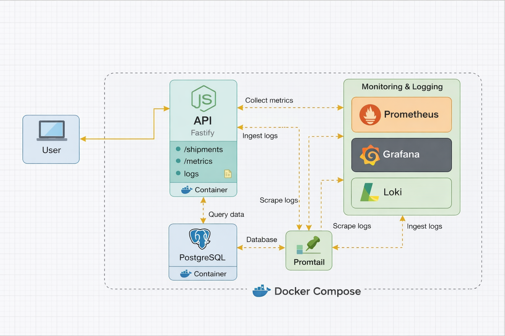

# Node DevOps Stack (Fastify + Postgres + Prometheus/Grafana + Loki)


A containerized Node.js API with a production-ish local observability stack.

## Architecture

<a href="docs/architecture.png">
  
</a>

**Overview**
- Single Fastify API container exposes REST endpoints
- PostgreSQL for persistence
- Prometheus scrapes metrics from the API
- Loki aggregates logs via Promtail
- Grafana visualizes metrics and logs

---

## Getting Started

### Start the stack

The entire stack (API, database, monitoring, logging) is started via Docker Compose.

```bash
make up
```

If make is not available (e.g. on Windows):

```bash
docker compose up -d --build
```

## Verification

Ensure all services are running:

```bash
docker compose ps
```

Check API readiness (database reachable):

```bash
curl http://localhost:3000/ready
```

## Example Usage

Create a shipment:

```bash
curl -X POST http://localhost:3000/shipments \
  -H "content-type: application/json" \
  -d "{\"status\":\"created\"}"
```

List shipments:

```bash
curl http://localhost:3000/shipments
```

## Observability Endpoints

### API

- http://localhost:3000/health
- http://localhost:3000/ready
- http://localhost:3000/metrics

### Grafana

- http://localhost:3001
- user: admin / pass: admin

### Prometheus

- http://localhost:9090

### Loki

- http://localhost:3100

## Notes

Promtail Docker log scraping can behave differently on Docker Desktop (Windows/macOS).
If required, consider an alternative log pipeline (e.g. Grafana Alloy or OpenTelemetry Collector).